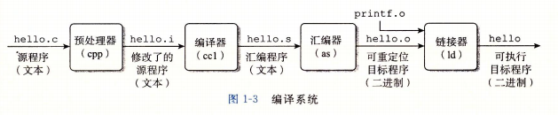
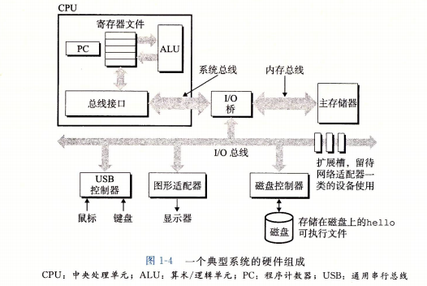

# CSAPP

## Ch.1 计算机系统漫游

1.2 程序被其他程序翻译成不同的格式

1.4.1 系统的硬件组成

Program counter: 在任何时刻， PC 都指向主存中的某条机器语言指令（即含有该条指令的地址）。
register file: 用于在内存与CPU运算部件之间暂存数据

1.10 小结

计算机系统是由硬件和系统软件组成的，它们共同协作以运行应用程序。计算机内部的信息被表示为一组组的位，它们依据上下文有不同的解释方式。程序被其他程序翻译成不同的形式，开始时是ASCII 文本，然后被编译器和链接器翻译成二进制可执行文件。

处理器读取并解释存放在主存里的二进制指令。因为计算机花费了大量的时间在内存、 I/0 设备和CPU 寄存器之间复制数据，所以将系统中的存储设备划分成层次结构 CPU 寄存器在顶部，接着是多层的硬件高速缓存存储器、 DRAM 主存和磁盘存储器。在层次模型中，位于更高层的存储设备比低层的存储设备要更快，单位比特造价也更高。层次结构中较高层次的存储设备可以作为较低层次设备的高速缓存。通过理解和运用这种存储层次结构的知识，程序员可以优化C程序的性能。

操作系统内核是应用程序和硬件之间的媒介。它提供三个基本的抽象： 1) 文件是对 I/0 设备的抽象；1) 虚拟内存是对主存和磁盘的抽象； 3) 进程是处理器、主存和 I/0 设备的抽象。

最后，网络提供了计算机系统之间通信的手段。从特殊系统的角度来看，网络就是一种 I/0 设备。

