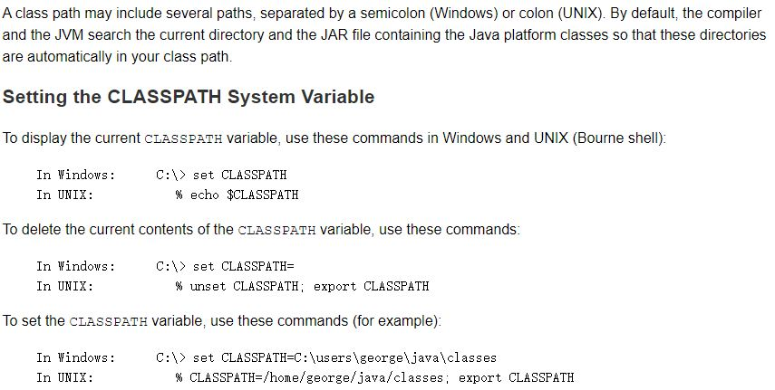

# Package

Note: If you put multiple types(classes and interfaces) in a single source file, only one can be public, and it must have the same name as the source file.

## Naming a Package

Package names are written in all lower case to avoid conflict with the names of classes or interfaces.

## Using Package Members
o use a public package member from outside its package, you must do one of the following:

- Refer to the member by its fully qualified name
- Import the package member
- Import the member's entire package

## Managing Source and Class Files
Many implementations of the Java platform rely on hierarchical file systems to manage source and class files, although The Java Language Specification does not require this.  

Example:
```
//in the Rectangle.java file
package com.example.graphics;
public class Rectangle {
      . . . 
}

class Helper{
      . . . 
}
```

You can arrange your source and class directories separately, as:
```
<path_one>\sources\com\example\graphics\Rectangle.java

<path_two>\classes\com\example\graphics\Rectangle.class
```
The full path to the classes directory, <path_two>\classes, is called the class path, and is set with the CLASSPATH system variable. Both the compiler and the JVM construct the path to your .class files by adding the package name to the class path. For example, if **<path_two>\classes** is your class path, and the package name is **com.example.graphics**, then the compiler and JVM look for .class files in **path_two\classes\com\example\graphics**



