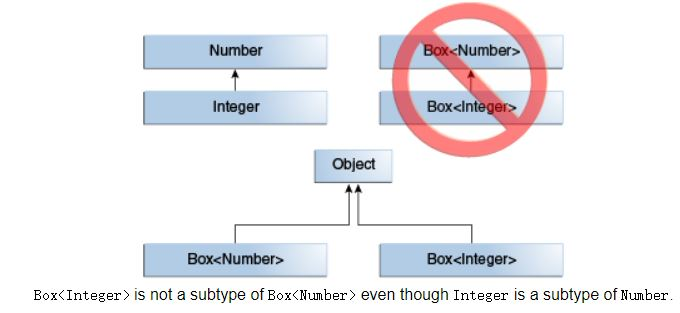
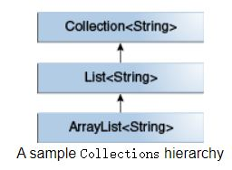
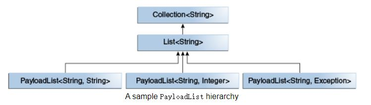
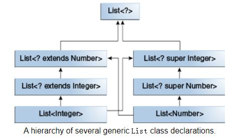

# Generics

## Why Use Generics?

### Benefits
1. Stronger type checks at compile time.
   A Java compiler applies strong type checking to generic code and issues errors if the code violates type safety. Fixing compile-time errors is easier than fixing runtime errors, which can be difficult to find.  
2. Elimination of casts.
```
// The following code snippet without generics requires casting:
List list = new ArrayList();
list.add("hello");
String s = (String) list.get(0);
```
```
// When re-written to use generics, the code does not require casting:
List<String> list = new ArrayList<String>();
list.add("hello");
String s = list.get(0);   // no cast
```
3. Enabling programmers to implement generic algorithms.
   By using generics, programmers can implement generic algorithms that work on collections of different types, can be customized, and are type safe and easier to read.

## Generic Types
**non-primitive type**  

The most commonly used type parameter names are:

E - Element (used extensively by the Java Collections Framework)
K - Key
N - Number
T - Type
V - Value
S,U,V etc. - 2nd, 3rd, 4th types

Note:  
the T in Foo<T> is a **type parameter**  
the String in Foo<String> f is a **type argument**  

Example for Invoking and Instantiating a Generic Type:  
invocation: ```ArrayList<Integer> list```  
instantiate: ```ArrayList<Integer> list = new ArrayList<Integer>();```

### Type Inference
```ArrayList<Integer> list = new ArrayList<>();```

### Parameterized Types
i.e., List<String>
EXAMPLE:  
```
OrderedPair<String, Box<Integer>> p = new OrderedPair<>("primes", new Box<Integer>(...));
```

### Raw Types

A raw type is the name of a generic class or interface without any type arguments.  
For example, given the generic Box class:
```
public class Box<T> {
    public void set(T t) { /* ... */ }
    // ...
}
```
To create a parameterized type of Box<T>, you supply an actual type argument for the formal type parameter T:
```
Box<Integer> intBox = new Box<>();
```
If the actual type argument is omitted, you create a raw type of Box<T>:
```
Box rawBox = new Box();
```
Therefore, Box is the raw type of the generic type Box<T>. However, a non-generic class or interface type is not a raw type.  

Raw types show up in legacy code because lots of API classes (such as the Collections classes) were not generic prior to JDK 5.0. When using raw types, you essentially get pre-generics behavior — a Box gives you Objects. For backward compatibility, assigning a parameterized type to its raw type is allowed:
```
Box<String> stringBox = new Box<>();
Box rawBox = stringBox;               // OK
```
But if you assign a raw type to a parameterized type, you get a warning:
```
Box rawBox = new Box();           // rawBox is a raw type of Box<T>
Box<Integer> intBox = rawBox;     // warning: unchecked conversion
```
You also get a warning if you use a raw type to invoke generic methods defined in the corresponding generic type:
```
Box<String> stringBox = new Box<>();
Box rawBox = stringBox;
rawBox.set(8);  // warning: unchecked invocation to set(T)
```
The warning shows that raw types bypass generic type checks, deferring the catch of unsafe code to runtime. Therefore, you should avoid using raw types.

## Bounded Type Parameters
To declare a bounded type parameter, list the type parameter's name, followed by the extends keyword, followed by its upper bound, which in this example is Number. Note that, in this context, extends is used in a general sense to mean either "extends" (as in classes) or "implements" (as in interfaces).  
Example:  
```
public <U extends Number> void inspect(U u){
     System.out.println("U: " + u.getClass().getName());
 }
```
In addition to limiting the types you can use to instantiate a generic type, bounded type parameters allow you to invoke methods defined in the bounds:
```
public class NaturalNumber<T extends Integer> {

    private T n;

    public NaturalNumber(T n)  { this.n = n; }

    public boolean isEven() {
        return n.intValue() % 2 == 0;
    }

    // ...
}
```
The isEven method invokes the intValue method defined in the Integer class through n.  
### Multiple Bounds
<T extends B1 & B2 & B3>
(B1 & B2 & B3 can be class and interface, but class must be specified first, otherwise you get a compile-time error)

#### Generic Methods and Bounded Type Parameters
**Important**  
```
public static <T> int countGreaterThan(T[] anArray, T elem) {
    int count = 0;
    for (T e : anArray)
        if (e > elem)  // compiler error since > cannot compare object
            ++count;
    return count;
}
```
The resulting code will be:
```
public static <T extends Comparable<T>> int countGreaterThan(T[] anArray, T elem) {
    int count = 0;
    for (T e : anArray)
        if (e.compareTo(elem) > 0)
            ++count;
    return count;
}
```

### Generics, Inheritance, and Subtypes




```
interface PayloadList<E,P> extends List<E> {
  void setPayload(int index, P val);
  ...
}
```


## Type Inference
The inference algorithm determines the types of the arguments and, if available, the type that the result is being assigned, or returned.  
To illustrate this last point, in the following example, inference determines that the second argument being passed to the pick method is of type **Serializable**:
```
static <T> T pick(T a1, T a2) { return a2; }
Serializable s = pick("d", new ArrayList<String>());
```

### Type Inference and Instantiation of Generic Classes

```
Map<String, List<String>> myMap = new HashMap<>();
```

### Type Inference and Generic Constructors of Generic and Non-Generic Classes

```
class MyClass<X> {
  <T> MyClass(T t) {
    // ...
  }
}

new MyClass<Integer>("")
```
This statement creates an instance of the parameterized type MyClass<Integer>; the statement explicitly specifies the type Integer for the formal type parameter, X, of the generic class MyClass<X>. Note that the constructor for this generic class contains a formal type parameter, T. The compiler infers the type String for the formal type parameter, T, of the constructor of this generic class (because the actual parameter of this constructor is a String object).  

**Note:** It is important to note that the inference algorithm uses only invocation arguments, target types, and possibly an obvious expected return type to infer types. The inference algorithm does not use results from later in the program.

### Target Types
```
static <T> List<T> emptyList();
List<String> listOne = Collections.emptyList(); //ok
List<String> listOne = Collections.<String>emptyList(); // Alternatively

void processStringList(List<String> stringList) {
    // process stringList
}
processStringList(Collections.emptyList()); // doesn't compile in Java SE 7, error message: List<Object> cannot be converted to List<String>
processStringList(Collections.<String>emptyList()); // ok
processStringList(Collections.emptyList()); // ok in Java SE 8
```

## Wildcards
In generic code, the question mark (?), called the wildcard, represents an unknown type. The wildcard can be used in a variety of situations: as the **type of a parameter**, **field**, or **local variable**; sometimes as a **return type** (though it is better programming practice to be more specific). The wildcard is **never used as a type argument for a generic method invocation, a generic class instance creation, or a supertype**.

### Upper Bounded Wildcards
Example: The term List<Number> is more restrictive than List<? extends Number> because the former matches a list of type Number only, whereas the latter matches a list of type Number or any of its subclasses.

### Unbounded Wildcards
There are two scenarios where an unbounded wildcard is a useful approach:
1. If you are writing a method that can be implemented using functionality provided in the Object class.
2. When the code is using methods in the generic class that don't depend on the type parameter. For example, List.size or List.clear. In fact, Class<?> is so often used because most of the methods in Class<T> do not depend on T.

```
public static void printList(List<Object> list) {
    for (Object elem : list)
        System.out.println(elem + " ");
    System.out.println();
}
```
The goal of printList is to print a list of any type, but it fails to achieve that goal — it prints only a list of Object instances; it cannot print List<Integer>, List<String>, List<Double>, and so on, because they are not subtypes of List<Object>. To write a generic printList method, use List<?>:
```
public static void printList(List<?> list) {
    for (Object elem: list)
        System.out.print(elem + " ");
    System.out.println();
}
```
It's important to note that List<Object> and List<?> are not the same. You can insert an Object, or any subtype of Object, into a List<Object>. But you can only insert null into a List<?>.

### Lower Bounded Wildcards
a lower bounded wildcard restricts the unknown type to be a specific type or a super type of that type.

A lower bounded wildcard is expressed using the wildcard character ('?'), following by the super keyword, followed by its lower bound: <? super A>.

Say you want to write a method that puts Integer objects into a list. To maximize flexibility, you would like the method to work on List<Integer>, List<Number>, and List<Object> — anything that can hold Integer values.

### Wildcards and Subtyping


### Wildcard Capture and Helper Methods
The WildcardError example produces a capture error when compiled:
```
import java.util.List;

public class WildcardError {

    void foo(List<?> i) {
        i.set(0, i.get(0));// the compiler is not able to confirm the type of object that is being inserted into the list
    }
}

```
Solution:  
```
public class WildcardFixed {

    void foo(List<?> i) {
        fooHelper(i);
    }


    // Helper method created so that the wildcard can be captured
    // through type inference.
    private <T> void fooHelper(List<T> l) {
        l.set(0, l.get(0));
    }

}
```

### Guidelines for Wildcard Use
One of the more confusing aspects when learning to program with generics is determining when to use an upper bounded wildcard and when to use a lower bounded wildcard. This page provides some guidelines to follow when designing your code.

For purposes of this discussion, it is helpful to think of variables as providing one of two functions:

**An "In" Variable**  
An "in" variable serves up data to the code. Imagine a copy method with two arguments: copy(src, dest). The src argument provides the data to be copied, so it is the "in" parameter.  
**An "Out" Variable**  
An "out" variable holds data for use elsewhere. In the copy example, copy(src, dest), the dest argument accepts data, so it is the "out" parameter.

Of course, some variables are used both for "in" and "out" purposes — this scenario is also addressed in the guidelines.

You can use the "in" and "out" principle when deciding whether to use a wildcard and what type of wildcard is appropriate. The following list provides the guidelines to follow:

**Wildcard Guidelines:**  
1. An "in" variable is defined with an upper bounded wildcard, using the extends keyword.  
2. An "out" variable is defined with a lower bounded wildcard, using the super keyword.  
3. In the case where the "in" variable can be accessed using methods defined in the Object class, use an unbounded wildcard.  
4. In the case where the code needs to access the variable as both an "in" and an "out" variable, do not use a wildcard.  

These guidelines do not apply to a method's return type. Using a wildcard as a return type should be avoided because it forces programmers using the code to deal with wildcards.

A list defined by List<? extends ...> can be informally thought of as read-only, but that is not a strict guarantee. Suppose you have the following two classes:
```
class NaturalNumber {

    private int i;

    public NaturalNumber(int i) { this.i = i; }
    // ...
}

class EvenNumber extends NaturalNumber {

    public EvenNumber(int i) { super(i); }
    // ...
}
```
Consider the following code:
```
List<EvenNumber> le = new ArrayList<>();
List<? extends NaturalNumber> ln = le;
ln.add(new NaturalNumber(35));  // compile-time error
```
Because List<EvenNumber> is a subtype of List<? extends NaturalNumber>, you can assign le to ln. But you cannot use ln to add a natural number to a list of even numbers. The following operations on the list are possible:

- You can add null.  
- You can invoke clear.  
- You can get the iterator and invoke remove.  
- You can capture the wildcard and write elements that you've read from the list.  

You can see that the list defined by List<? extends NaturalNumber> is not read-only in the strictest sense of the word, but you might think of it that way because you cannot store a new element or change an existing element in the list.

## Type Erasure

泛型信息只存在于代码编译阶段，在进入 JVM 之前，与泛型相关的信息会被擦除掉，专业术语叫做类型擦除。  
To implement generics, the Java compiler applies type erasure to:

1. Replace all type parameters in generic types with their bounds or Object if the type parameters are unbounded. The produced bytecode, therefore, contains only ordinary classes, interfaces, and methods.  
2. Insert type casts if necessary to preserve type safety.  
3. Generate bridge methods to preserve polymorphism in extended generic types.  

Type erasure ensures that no new classes are created for parameterized types; consequently, generics incur no runtime overhead.   

During the type erasure process, the Java compiler erases all type parameters and replaces each with its first bound if the type parameter is bounded, or Object if the type parameter is unbounded.  


### Bridge Methods
When compiling a class or interface that extends a parameterized class or implements a parameterized interface, the compiler may need to create a synthetic method, called a bridge method, as part of the type erasure process. You normally don't need to worry about bridge methods, but you might be puzzled if one appears in a stack trace.

After type erasure, the Node and MyNode classes become:
```
public class Node {

    public Object data;

    public Node(Object data) { this.data = data; }

    public void setData(Object data) {
        System.out.println("Node.setData");
        this.data = data;
    }
}

public class MyNode extends Node {

    public MyNode(Integer data) { super(data); }

    public void setData(Integer data) {
        System.out.println("MyNode.setData");
        super.setData(data);
    }
}
```
After type erasure, the method signatures do not match. The Node method becomes setData(Object) and the MyNode method becomes setData(Integer). Therefore, the MyNode setData method does not override the Node setData method.

To solve this problem and preserve the polymorphism of generic types after type erasure, a Java compiler generates a bridge method to ensure that subtyping works as expected. For the MyNode class, the compiler generates the following bridge method for setData:
```
class MyNode extends Node {

    // Bridge method generated by the compiler
    //
    public void setData(Object data) {
        setData((Integer) data);
    }

    public void setData(Integer data) {
        System.out.println("MyNode.setData");
        super.setData(data);
    }

    // ...
}
```

When the compiler encounters a varargs method, it translates the varargs formal parameter into an array. However, the Java programming language does not permit the creation of arrays of parameterized types. However, because of type erasure, the compiler converts the varargs formal parameter to Object[] elements. Consequently, there is a possibility of heap pollution.

### Prevent Warnings from Varargs Methods with Non-Reifiable Formal Parameters
If you declare a varargs method that has parameters of a parameterized type, and you ensure that the body of the method does not throw a ClassCastException or other similar exception due to improper handling of the varargs formal parameter, you can prevent the warning that the compiler generates for these kinds of varargs methods by adding the following annotation to static and non-constructor method declarations:
```
@SafeVarargs
```
The @SafeVarargs annotation is a documented part of the method's contract; this annotation asserts that the implementation of the method will not improperly handle the varargs formal parameter.

It is also possible, though less desirable, to suppress such warnings by adding the following to the method declaration:
```
@SuppressWarnings({"unchecked", "varargs"})
```

## Restrictions on Generics

To use Java generics effectively, you must consider the following restrictions:

1. Cannot Instantiate Generic Types with Primitive Types  
2. Cannot Create Instances of Type Parameters  
```
public static <E> void append(List<E> list) {
    E elem = new E();  // compile-time error
    list.add(elem);
}
```
3. Cannot Declare Static Fields Whose Types are Type Parameters  
4. Cannot Use Casts or instanceof With Parameterized Types  
5. Cannot Create Arrays of Parameterized Types  
6. Cannot Create, Catch, or Throw Objects of Parameterized Types  
```
// Extends Throwable indirectly
class MathException<T> extends Exception { /* ... */ }    // compile-time error

// Extends Throwable directly
class QueueFullException<T> extends Throwable { /* ... */ // compile-time error

// A method cannot catch an instance of a type parameter:
public static <T extends Exception, J> void execute(List<J> jobs) {
    try {
        for (J job : jobs)
            // ...
    } catch (T e) {   // compile-time error
        // ...
    }
}

// You can, however, use a type parameter in a throws clause:
class Parser<T extends Exception> {
    public void parse(File file) throws T {     // OK
        // ...
    }
}
```
7. Cannot Overload a Method Where the Formal Parameter Types of Each Overload Erase to the Same Raw Type  

```
// A class cannot have two overloaded methods that will have the same signature after type erasure.

public class Example {
    public void print(Set<String> strSet) { }
    public void print(Set<Integer> intSet) { }//a compile-time error.
}
```

[Good question and exercises](https://docs.oracle.com/javase/tutorial/java/generics/QandE/generics-answers.html)

