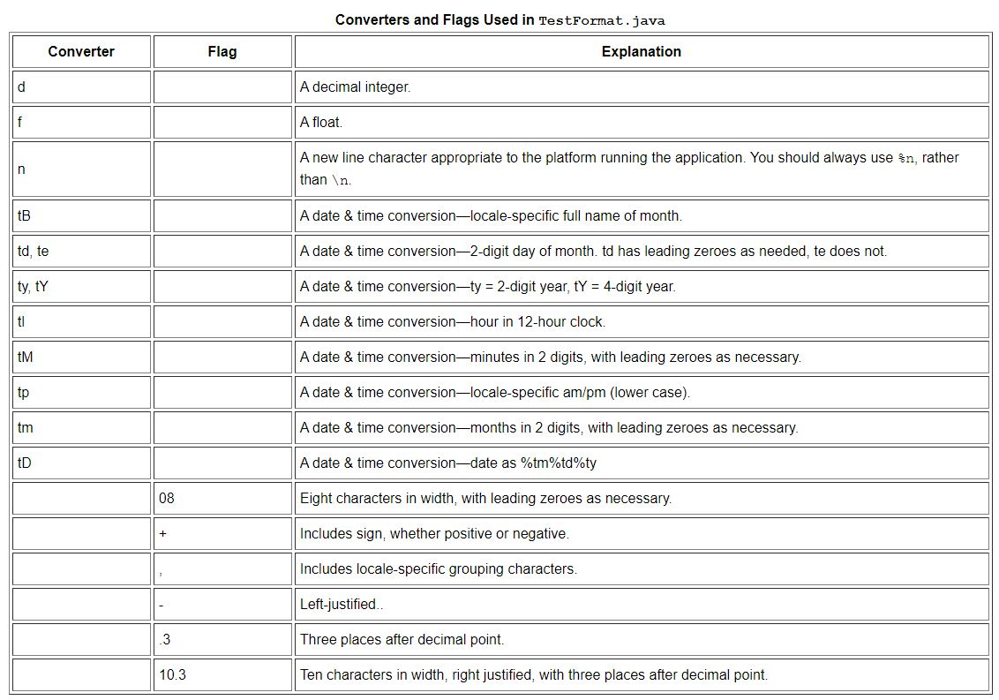
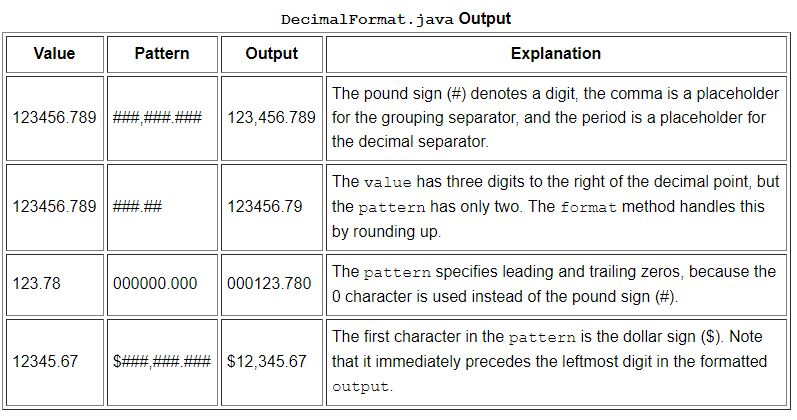

# Numbers

## The Numbers Classes

If you use a **primitive** where **an object** is expected, the compiler **box**es the primitive in its wrapper class for you. Similarly, if you use a **number object** when a **primitive** is expected, the compiler **unbox**es the object for you.  

Note:  
**BigDecimal and BigInteger** are used for high-precision calculations.  
**AtomicInteger and AtomicLong** are used for multi-threaded applications.  

There are three reasons that you might use a Number object rather than a primitive:  
1. As an argument of a method that expects an object (often used when manipulating collections of numbers).  
2. To use constants defined by the class, such as MIN_VALUE and MAX_VALUE, that provide the upper and lower bounds of the data type.  
3. To use class methods for converting values to and from other primitive types, for converting to and from strings, and for converting between number systems (decimal, octal, hexadecimal, binary).  

## Formatting Numeric Print Output

**System.out** is a **PrintStream** object.
System.out.format(String format, Object... args);


[https://docs.oracle.com/javase/tutorial/java/data/numberformat.html](TestFormat.java)

## The DecimalFormat Class
You can use the java.text.DecimalFormat class to control the display of leading and trailing zeros, prefixes and suffixes, grouping (thousands) separators, and the decimal separator.  

Example:  
```
import java.text.*;

public class DecimalFormatDemo {

   static public void customFormat(String pattern, double value ) {
      DecimalFormat myFormatter = new DecimalFormat(pattern);
      String output = myFormatter.format(value);
      System.out.println(value + "  " + pattern + "  " + output);
   }

   static public void main(String[] args) {

      customFormat("###,###.###", 123456.789);
      customFormat("###.##", 123456.789);
      customFormat("000000.000", 123.78);
      customFormat("$###,###.###", 12345.67);  
   }
}
```

output:  


Good Exercise:  
[https://docs.oracle.com/javase/tutorial/java/data/QandE/numbers-questions.html](Questions and Exercises: Numbers)

# Strings

Note:  
Java does not permit literal strings to span lines in source files, so you must use the + concatenation operator at the end of each line in a multi-line string. E.g.
```
String quote = 
    "Now is the time for all good " +
    "men to come to the aid of their country.";
```

## Autoboxing and Unboxing

Autoboxing is Converting a primitive value into an object of the corresponding wrapper class.  
The Java compiler applies autoboxing when a primitive value is:

- Passed as a parameter to a method that expects an object of the corresponding wrapper class.  
- Assigned to a variable of the corresponding wrapper class.  
Example:  
```
Character ch = 'a';
```
```
List<Integer> li = new ArrayList<>();
for (int i = 1; i < 50; i += 2)
    li.add(i);
```
The compiler converts the previous code to the following at runtime:
```
List<Integer> li = new ArrayList<>();
for (int i = 1; i < 50; i += 2)
    li.add(Integer.valueOf(i));
```

unboxing is Converting an object of a wrapper type to its corresponding primitive value.  

The Java compiler applies unboxing when an object of a wrapper class is:

- Passed as a parameter to a method that expects a value of the corresponding primitive type.  
- Assigned to a variable of the corresponding primitive type.  