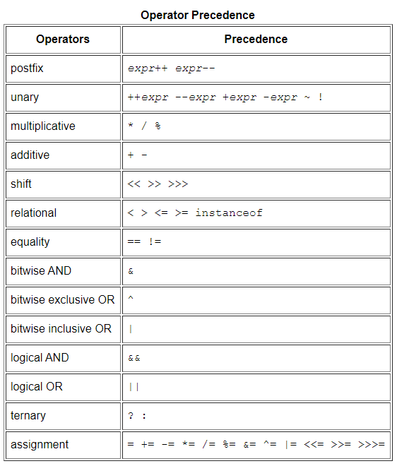
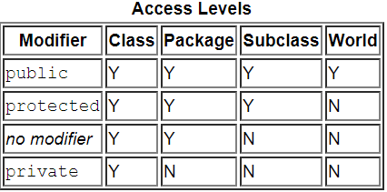
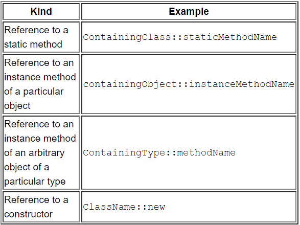

- [Java (JDK 8)](#java-jdk-8)
  - [Object-Oriented Programming Concepts](#object-oriented-programming-concepts)
  - [Language Basics](#language-basics)
    - [Variables](#variables)
      - [Naming](#naming)
      - [Literals](#literals)
      - [Array](#array)
    - [Operators](#operators)
      - [Precedence order](#precedence-order)
      - [Increment and Decrement operator](#increment-and-decrement-operator)
      - [The Type Comparison Operator instanceof](#the-type-comparison-operator-instanceof)
      - [Bitwise and Bit Shift Operators](#bitwise-and-bit-shift-operators)
      - [Switch Statement](#switch-statement)
  - [Class and Objects](#class-and-objects)
    - [Member Variables](#member-variables)
    - [Overloading Methods](#overloading-methods)
    - [Constructor](#constructor)
      - [Using this with a Constructor](#using-this-with-a-constructor)
    - [Arbitrary Number of Arguments](#arbitrary-number-of-arguments)
    - [Passing Arguments](#passing-arguments)
    - [Garbage Collector](#garbage-collector)
    - [Returning a Class or Interface](#returning-a-class-or-interface)
    - [Controlling Access](#controlling-access)
    - [Class Variables And Methods](#class-variables-and-methods)
    - [Initializing Fields](#initializing-fields)
      - [Static Initialization Blocks](#static-initialization-blocks)
      - [Initializing Instance Members](#initializing-instance-members)
    - [Nexted Classes](#nexted-classes)
      - [Why Use Nested Classes?](#why-use-nested-classes)
      - [Static Nested Classes](#static-nested-classes)
      - [Inner Classes](#inner-classes)
        - [Shadowing](#shadowing)
      - [Local Class](#local-class)
      - [Anonymous Classes](#anonymous-classes)
        - [Acessing Vatiables](#acessing-vatiables)
        - [Lambda Expressions](#lambda-expressions)
          - [Accessing Local Variables of the Enclosing Scope](#accessing-local-variables-of-the-enclosing-scope)
          - [Target Type](#target-type)
        - [When to Use Nested Classes, Local Classes, Anonymous Classes, and Lambda Expressions](#when-to-use-nested-classes-local-classes-anonymous-classes-and-lambda-expressions)
        - [Method Referecnces](#method-referecnces)
        - [Enum Type](#enum-type)
  - [Source](#source)

# Java (JDK 8)

## Object-Oriented Programming Concepts

An object stores its state in fields (variables in some programming languages) and exposes its behavior through methods (functions in some programming languages).  

Data encapsulation： Hiding internal state and requiring all interaction to be performed through an object's methods  

Benefit:  
1. Modularity: The source code for an object can be written and maintained independently of the source code for other objects. Once created, an object can be easily passed around inside the system.
2. Information-hiding: By interacting only with an object's methods, the details of its internal implementation remain hidden from the outside world.
3. Code re-use: If an object already exists (perhaps written by another software developer), you can use that object in your program. This allows specialists to implement/test/debug complex, task-specific objects, which you can then trust to run in your own code.
4. Pluggability and debugging ease: If a particular object turns out to be problematic, you can simply remove it from your application and plug in a different object as its replacement. This is analogous to fixing mechanical problems in the real world. If a bolt breaks, you replace it, not the entire machine.

Interface:  
Implementing an interface allows a class to become more formal about the behavior it promises to provide. Interfaces form a contract between the class and the outside world, and this contract is enforced at build time by the compiler. If your class claims to implement an interface, all methods defined by that interface must appear in its source code before the class will successfully compile.

Package:  
A package is a namespace that organizes a set of related classes and interfaces.  
The Java platform provides an enormous class library (a set of packages) suitable for use in your own applications. This library is known as the "Application Programming Interface", or "API" for short.

## Language Basics

### Variables

- Instance Variables (Non-Static Fields) 
  - Values are unique to each instance of a class.
- Class Variables (Static Fields)
  - Exactly one copy of this variable in existence, regardless of how many times the class has been instantiated. The  keyword **final** could be added to indicate that the number of gears will never change.
- Local Variables
  - A method will often store its temporary state in local variables. Only visible to the methods in which they are declared.
- Parameters

**Initial Value**:  
 The compiler will assign a reasonable default value for fields of eight primitive data types ( byte, short, int, long, float, double, boolean, and char. The java.lang.String class represents character strings ) types; for local variables, a default value is never assigned.  

#### Naming

- Variable names are case-sensitive. A variable's name can be any legal identifier — an unlimited-length sequence of Unicode letters and digits, beginning with a letter, the dollar sign "$" (hint: never to use), or the underscore character "_".
- Subsequent characters may be letters, digits, dollar signs, or underscore characters.

Statically-typed: all variables must first be declared before they can be used.

#### Literals

Decimal: 26  
Hexadecimal: 0x1a  
Binary: 0b11010  
Double: 11.1 or 11.1d  
float: 11.1f  
scientific notation: 1.11e1 
Unicode(char): '\u000'~'\uffff'  
String: "a" or null  
\b (backspace), \t (tab), \n (line feed), \f (form feed), \r (carriage return), \" (double quote), \' (single quote), and \\ (backslash).  

Underscore Characters  
Example:  
```java
long creditCardNumber = 1234_5678_9012_3456L;
long socialSecurityNumber = 999_99_9999L;
float pi =  3.14_15F;
long hexBytes = 0xFF_EC_DE_5E;
long hexWords = 0xCAFE_BABE;
long maxLong = 0x7fff_ffff_ffff_ffffL;
byte nybbles = 0b0010_0101;
long bytes = 0b11010010_01101001_10010100_10010010;
```
**Cannot place underscores in the following places:**
- At the beginning or end of a number
- Adjacent to a decimal point in a floating point literal
- Prior to an F or L suffix
- In positions where a string of digits is expected

#### Array

4 ways copy:
1. clone
```java
String[] a1 = {1, 3};
String[] a2 = a1.clone();
```
2. System.arraycopy
```java
public static native void arraycopy(Object src, int srcPos, Object dest, int desPos, int length)
```
3. Arrays.copyOf
```java
public static <T,U> T[] copyOf(U[] original, int newLength, Class<? extends T[]> newType) {
    @SuppressWarnings("unchecked")
    T[] copy = ((Object)newType == (Object)Object[].class)
        ? (T[]) new Object[newLength]
        : (T[]) Array.newInstance(newType.getComponentType(), newLength);
    System.arraycopy(original, 0, copy, 0,
                     Math.min(original.length, newLength));
    return copy;
}
```
4. Arrays.copyOfRange
```java
public static <T,U> T[] copyOfRange(U[] original, int from, int to, Class<? extends T[]> newType) {
    int newLength = to - from;
    if (newLength < 0)
        throw new IllegalArgumentException(from + " > " + to);
    @SuppressWarnings("unchecked")
    T[] copy = ((Object)newType == (Object)Object[].class)
        ? (T[]) new Object[newLength]
        : (T[]) Array.newInstance(newType.getComponentType(), newLength);
    System.arraycopy(original, from, copy, 0,
                     Math.min(original.length - from, newLength));
    return copy;
}
```

Useful Methods in **java.util.Arrays** class:  
1. Searching an array for a specific value to get the index at which it is placed (the **binarySearch** method).
2. Comparing two arrays to determine if they are equal or not (the **equals** method).
3. Filling an array to place a specific value at each index (the **fill** method).
4. Sorting an array into ascending order. This can be done either sequentially, using the sort method, or concurrently, using the **parallelSort** method introduced in Java SE 8. Parallel sorting of large arrays on multiprocessor systems is faster than sequential array sorting.

### Operators

#### Precedence order

All binary operators except for the assignment operators are evaluated from left to right; assignment operators are evaluated right to left.  



#### 	Increment and Decrement operator

The only difference is that the prefix version (++result) evaluates to the incremented value, whereas the postfix version (result++) evaluates to the original value.  
```
int i = 0;
// print 1
System.out.println(++i);
i = 0;
// print 0
System.out.println(i++);
```

#### The Type Comparison Operator instanceof

The following program, InstanceofDemo, defines a parent class (named Parent), a simple interface (named MyInterface), and a child class (named Child) that inherits from the parent and implements the interface.  
```
class InstanceofDemo {
 public static void main(String[] args) {
  Parent obj1 = new Parent();
  Parent obj2 = new Child();

  System.out.println("obj1 instanceof Parent: "
      + (obj1 instanceof Parent));
  System.out.println("obj1 instanceof Child: "
      + (obj1 instanceof Child));
  System.out.println("obj1 instanceof MyInterface: "
      + (obj1 instanceof MyInterface));
  System.out.println("obj2 instanceof Parent: "
      + (obj2 instanceof Parent));
  System.out.println("obj2 instanceof Child: "
      + (obj2 instanceof Child));
  System.out.println("obj2 instanceof MyInterface: "
      + (obj2 instanceof MyInterface));
 }
}
class Parent {}
class Child extends Parent implements MyInterface {}
interface MyInterface {}
```
Output:
```
obj1 instanceof Parent: true
obj1 instanceof Child: false
obj1 instanceof MyInterface: false
obj2 instanceof Parent: true
obj2 instanceof Child: true
obj2 instanceof MyInterface: true
```
When using the instanceof operator, keep in mind that null is not an instance of anything.

#### Bitwise and Bit Shift Operators

The **unary** bitwise complement operator "~" inverts a bit pattern; it can be applied to any of the integral types, making every "0" a "1" and every "1" a "0". For example, a byte contains 8 bits; applying this operator to a value whose bit pattern is "00000000" would change its pattern to "11111111".

The signed left shift operator "<<" shifts a bit pattern to the left, and the signed right shift operator ">>" shifts a bit pattern to the right. The bit pattern is given by the left-hand operand, and the number of positions to shift by the right-hand operand. The unsigned right shift operator ">>>" shifts a zero into the leftmost position, while the leftmost position after ">>" depends on sign extension.

[Example](https://developer.mozilla.org/zh-CN/docs/Web/JavaScript/Reference/Operators/Bitwise_Operators)

The bitwise & operator performs a bitwise AND operation.

The bitwise ^ operator performs a bitwise exclusive OR operation.

The bitwise | operator performs a bitwise inclusive OR operation.

#### Switch Statement

A switch works with the **byte, short, char, and int** primitive data types. It also works with **enumerated types, the String class**, and a few special classes that wrap certain primitive types: **Character, Byte, Short, and Integer.**

## Class and Objects

**Note:**
1. A class can **only extend (subclass) one parent**. A class can implement **more than one interface**.  
2. The first letter of a class name should be **capitalized**, the first (or only) word in a method name should be a verb.  

### Member Variables

Field, local variable, parameter  
Field components: Zero or more modifiers, such as public or private. The field's type. The field's name.  

### Overloading Methods
You cannot declare more than one method with** the same name and the same number and type of arguments**, because the compiler cannot tell them apart.  
The compiler does not consider return type when differentiating methods, so you cannot declare two methods with the **same signature** even if they have a **different return type**.  

### Constructor
As with methods, the Java platform differentiates constructors on the basis of the number of arguments in the list and their types.  
The compiler **automatically provides a no-argument, default constructor** for any class without constructors. This default constructor will call the no-argument constructor of the superclass. In this situation, the compiler will complain if the superclass doesn't have a no-argument constructor so you must verify that it does. If your class has no explicit superclass, then it has an implicit superclass of ```Object```, which does have a no-argument constructor.  

#### Using this with a Constructor
Example:
```
public class Rectangle {
    private int x, y;
    private int width, height;
        
    public Rectangle() {
        // If present, the invocation of another constructor must be the first line in the constructor.
        this(0, 0, 1, 1);
    }
    public Rectangle(int width, int height) {
        this(0, 0, width, height);
    }
    public Rectangle(int x, int y, int width, int height) {
        this.x = x;
        this.y = y;
        this.width = width;
        this.height = height;
    }
    ...
}
```

### Arbitrary Number of Arguments
**Parameters** refers to the list of variables in a method declaration. **Arguments** are the actual values that are passed in when the method is invoked.  

You use **varargs** when you don't know how many of a particular type of argument will be passed to the method.  It's a shortcut to creating an array manually. (E.g. ```args``` in the following example, use args.length to get the length of argumnet array.)

To use **varargs**, you follow the type of the last parameter by an ellipsis (three dots, ...), then a space, and the parameter name. The method can then be called with any number of that parameter, including **none**.  

You will most commonly see varargs with the printing methods; for example, this printf method:
```
public PrintStream printf(String format, Object... args)
```

### Passing Arguments

Primitive Data Type Arguments: any changes to the values of the parameters exist only within the scope of the method. When the method returns, the parameters are gone and any changes to them are lost.  
Reference Data Type Arguments: such as objects, are also passed into methods by value. This means that when the method returns, the passed-in reference still references the same object as before. However, the values of the object's fields can be changed in the method, if they have the proper access level.  

Important Example:
consider a method in an arbitrary class that moves **Circle** objects:
```
public void moveCircle(Circle circle, int deltaX, int deltaY) {
    // code to move origin of circle to x+deltaX, y+deltaY
    circle.setX(circle.getX() + deltaX);
    circle.setY(circle.getY() + deltaY);
        
    // code to assign a new reference to circle
    circle = new Circle(0, 0);
}
```
Let the method be invoked with these arguments:
```
moveCircle(myCircle, 23, 56)
```
Inside the method, **circle** initially refers to **myCircle**. The method changes the x and y coordinates of the object that circle references (i.e., **myCircle**) by 23 and 56, respectively. These changes will persist when the method returns. Then **circle** is assigned a reference to a new **Circle** object with x = y = 0. This reassignment has no permanence, however, because the reference was passed in by value and cannot change.   
Within the method, the object pointed to by **circle** has changed, but, when the method returns, **myCircle** still references the same Circle object as before the method was called.

### Garbage Collector

The Java runtime environment deletes objects when it determines that they are no longer being used. This process is called garbage collection.  

### Returning a Class or Interface

 When a method uses a class name as its return type, the class of the type of the returned object must be either a subclass of, or the exact class of, the return type.

 You can override a method and define it to return a subclass of the original method. This technique, called covariant return type, means that the return type is allowed to vary in the same direction as the subclass.

 You also can use **interface** names as return types. In this case, the object returned **must** implement the specified interface.

### Controlling Access

A **class** may be declared with the modifier **public**, in which case that class is visible to all classes everywhere. If a class has no modifier (the **default**, also known as **package-private**), it is visible only within its own package.

At the member level, you can also use the **public** modifier or no modifier (**package-private**) just as with top-level classes, and with the same meaning. For members, there are two additional access modifiers: private and protected. The **private** modifier specifies that the member can only be accessed in its own class. The **protected** modifier specifies that the member can only be accessed within its **own package** (as with **package-private**) and, in addition, by a **subclass of its class in another package**.

The following table shows the access to members permitted by each modifier.



### Class Variables And Methods
Fields that have the ```static``` modifier in their declaration are called static fields or class variables. They are associated with the class, rather than with any object.  Every instance of the class shares a class variable, which is in one fixed location in memory. Any object can **change** the value of a class variable, but class variables can also be **manipulated** without creating an instance of the class.

E.g. You can count the number of instances of a class using ```static```  
[Example](https://docs.oracle.com/javase/tutorial/java/javaOO/classvars.html)  

Note: Class methods cannot access instance variables or instance methods directly. Instance methods can access class variables and class methods directly.  

Define Constant: ```static final```  
Note: If a primitive type or a string is defined as a constant and the value is known at compile time, the compiler replaces the constant name everywhere in the code with its value. This is called a **compile-time constant**. If the value of the constant in the outside world changes (for example, if it is legislated that pi actually should be 3.975), you will need to **recompile any classes** that use this constant to get the current value.

### Initializing Fields
#### Static Initialization Blocks
One line initialization has limitations. If initialization requires some logic (for example, error handling or a for loop to fill a complex array), simple assignment is inadequate.

Solution: A static initialization block is a normal block of code enclosed in braces, { }, and preceded by the static keyword. Here is an example:
```
static {
    // whatever code is needed for initialization goes here
}
```
A class can have any number of static initialization blocks, and they can appear anywhere in the class body. The runtime system guarantees that static initialization blocks are called in the order that they appear in the source code.

There is an alternative to static blocks — you can write a private static method:
```
class Whatever {
    public static varType myVar = initializeClassVariable();
        
    private static varType initializeClassVariable() {

        // initialization code goes here
    }
}
```
The advantage of private static methods is that they can be reused later if you need to reinitialize the class variable.

#### Initializing Instance Members
Normally, you would put code to initialize an instance variable in a constructor. There are two alternatives to using a constructor to initialize instance variables: initializer blocks and final methods.

Initializer blocks for instance variables look just like static initializer blocks, but without the static keyword:
```
{
    // whatever code is needed for initialization goes here
}
```
The Java compiler copies initializer blocks into every constructor. Therefore, this approach can be used to share a block of code between multiple constructors.

A final method cannot be overridden in a subclass. This is discussed in the lesson on interfaces and inheritance. Here is an example of using a final method for initializing an instance variable:
```
class Whatever {
    private varType myVar = initializeInstanceVariable();
        
    protected final varType initializeInstanceVariable() {

        // initialization code goes here
    }
}
```
This is especially useful if subclasses might want to reuse the initialization method. The method is final because calling non-final methods during instance initialization can cause problems.

### Nexted Classes
Nested classes are divided into two categories: **static** and **non-static**. Nested classes that are declared static are called static nested classes. Non-static nested classes are called inner classes.

**Non-static nested classes** (inner classes) have access to other members of the enclosing class, *even if they are declared private*. **Static nested classes** do **not** have access to other members of the enclosing class.

As a member of the OuterClass, a nested class can be declared **private**, **public**, **protected**, or **package private**. (Recall that outer classes can only be declared *public* or *package private*.)

#### Why Use Nested Classes?
- It is a way of logically grouping classes that are only used in one place
- It increases encapsulation:
  - Consider two top-level classes, A and B, where B needs access to members of A that would otherwise be declared private.
- It can lead to more readable and maintainable code

#### Static Nested Classes
As with class methods and variables, a static nested class is associated with its outer class. And like static class methods, a static nested class cannot refer directly to instance variables or methods defined in its enclosing class: it can use them only through an object reference.

**Note**: A static nested class interacts with the instance members of its outer class (and other classes) just like any other top-level class. In effect, a static nested class is behaviorally a top-level class that has been nested in another top-level class for packaging convenience.

For example, to create an object for the static nested class, use this syntax:
```
OuterClass.StaticNestedClass nestedObject =
     new OuterClass.StaticNestedClass();
```

#### Inner Classes
As with instance methods and variables, an inner class is associated with **an instance of its enclosing class** and has direct access to that object's methods and fields. Also, because an inner class is associated with an instance, it **cannot** define any static members itself.

Objects that are instances of an inner class exist within an instance of the outer class. An instance of InnerClass can exist only within an instance of OuterClass and has direct access to the methods and fields of its enclosing instance.

To instantiate an inner class, you must first instantiate the outer class. Then, create the inner object within the outer object with this syntax:
```
OuterClass.InnerClass innerObject = outerObject.new InnerClass();
```
There are two additional types of inner classes. You can declare an inner class within the body of a method. These classes are known as **local classes**. You can also declare an inner class within the body of a method without naming the class. These classes are known as **anonymous classes**.

[Example](https://docs.oracle.com/javase/tutorial/java/javaOO/innerclasses.html)

##### Shadowing

Example:
```
public class ShadowTest {

    public int x = 0;

    class FirstLevel {

        public int x = 1;

        void methodInFirstLevel(int x) {
            System.out.println("x = " + x);
            System.out.println("this.x = " + this.x);
            System.out.println("ShadowTest.this.x = " + ShadowTest.this.x);
        }
    }

    public static void main(String... args) {
        ShadowTest st = new ShadowTest();
        ShadowTest.FirstLevel fl = st.new FirstLevel();
        fl.methodInFirstLevel(23);
    }
}
```
Output:
```
x = 23
this.x = 1
ShadowTest.this.x = 0
```

Note: Serialization of inner classes, including local and anonymous classes, is strongly discouraged.

#### Local Class

Local classes are classes that are defined in a block, which is a group of zero or more statements between balanced braces. You typically find local classes defined in the body of a method.  

**Note:**
1. A local class has access to the members of its enclosing class.  
2. Local classes in **static methods** can only refer to **static** members of the enclosing class.
3. In addition, a local class has access to local variables. However, a local class can only access local variables that are declared final. When a local class accesses a local variable or parameter of the enclosing block, it *captures* that variable or parameter.  
4. Starting in Java SE 8, a local class can access local variables and parameters of the enclosing block that are **final** or **effectively final**.  A variable or parameter whose value is never changed after it is initialized is **effectively final**.  
5. Starting in Java SE 8, if you declare the local class in a method, it can access the method's parameters.  
6. Local classes are non-static because they have access to instance members of the enclosing block. Consequently, they **cannot** contain **most** kinds of **static declarations**.  
7. You cannot declare an interface inside a block (including local class); interfaces are inherently static.  
8. A local class can have **static members** provided that they are **constant variables**. (A constant variable is a variable of primitive type or type String that is declared final and initialized with a compile-time constant expression)

#### Anonymous Classes

While local classes are class declarations, anonymous classes are expressions, which means that you define the class in another expression.  
The syntax of an anonymous class expression is like the invocation of a constructor, except that there is a class definition contained in a block of code.  
Example:
```
HelloWorld frenchGreeting = new HelloWorld() {
   String name = "tout le monde";
   public void greet() {
       greetSomeone("tout le monde");
   }
   public void greetSomeone(String someone) {
       name = someone;
       System.out.println("Salut " + name);
   }
};
```

The anonymous class expression consists of the following:
- The **new** operator

- The name of an interface to implement or a class to extend. In this example, the anonymous class is implementing the interface HelloWorld.

- Parentheses that contain the arguments to a constructor, just like a normal class instance creation expression. **Note**: When you implement an interface, there is no constructor, so you use an empty pair of parentheses, as in this example.

- A body, which is a class declaration body. More specifically, in the body, method declarations are allowed but statements are not.

##### Acessing Vatiables
Like local classes, anonymous classes can capture variables; they have the same access to local variables of the enclosing scope:

- An anonymous class has access to the members of its enclosing class.

- An anonymous class **cannot** access local variables in its enclosing scope that are not declared as final or effectively final.

- Like a nested class, a declaration of a type (such as a variable) in an anonymous class shadows any other declarations in the enclosing scope that have the same name.
  
Anonymous classes also have the same restrictions as local classes with respect to their members:

- You **cannot** declare static initializers or member interfaces in an anonymous class.

- An anonymous class can have static members provided that they are constant variables.

##### Lambda Expressions

Why to use Lambda Expressions:  
One issue with anonymous classes is that if the implementation of your anonymous class is very simple, such as an interface that contains only one method, then the syntax of anonymous classes may seem unwieldy and unclear. In these cases, you're usually trying to pass functionality as an argument to another method, such as what action should be taken when someone clicks a button. Lambda expressions enable you to do this, to treat functionality as method argument, or code as data.

**Important**
[Example](https://docs.oracle.com/javase/tutorial/java/javaOO/lambdaexpressions.html)

Here are some examples from above Source.  

**Example 1**  
```
public static <X, Y> void processElements(
    Iterable<X> source,
    Predicate<X> tester,
    Function <X, Y> mapper,
    Consumer<Y> block) {
    for (X p : source) {
        if (tester.test(p)) {
            Y data = mapper.apply(p);
            block.accept(data);
        }
    }
}
processElements(
    roster,
    p -> p.getGender() == Person.Sex.MALE
        && p.getAge() >= 18
        && p.getAge() <= 25,
    p -> p.getEmailAddress(),
    email -> System.out.println(email)
);
```

**Example 2**  
in a lambda expression, you must enclose statements in braces (**{}**). However, you do not have to enclose a void method invocation in braces.  
```
p -> {
    return p.getGender() == Person.Sex.MALE
        && p.getAge() >= 18
        && p.getAge() <= 25;
}
``` 

**Example 3**  
```
public class Calculator {
  
    interface IntegerMath {
        int operation(int a, int b);   
    }
  
    public int operateBinary(int a, int b, IntegerMath op) {
        return op.operation(a, b);
    }
 
    public static void main(String... args) {
    
        Calculator myApp = new Calculator();
        IntegerMath addition = (a, b) -> a + b;
        IntegerMath subtraction = (a, b) -> a - b;
        System.out.println("40 + 2 = " +
            myApp.operateBinary(40, 2, addition));
        System.out.println("20 - 10 = " +
            myApp.operateBinary(20, 10, subtraction));    
    }
}
```

###### Accessing Local Variables of the Enclosing Scope

Like local and anonymous classes, lambda expressions can capture variables; they have the same access to local variables of the enclosing scope.  
However, unlike local and anonymous classes, lambda expressions do not have any shadowing issues.  
Lambda expressions are lexically scoped. This means that they do not inherit any names from a supertype or introduce a new level of scoping. Declarations in a lambda expression are interpreted just as they are in the enclosing environment.  

Example:
```
import java.util.function.Consumer;

public class LambdaScopeTest {

    public int x = 0;

    class FirstLevel {

        public int x = 1;

        void methodInFirstLevel(int x) {
            
            // The following statement causes the compiler to generate
            // the error "local variables referenced from a lambda expression
            // must be final or effectively final" in statement A:
            //
            // x = 99;
            
            Consumer<Integer> myConsumer = (y) -> 
            {
                System.out.println("x = " + x); // Statement A
                System.out.println("y = " + y);
                System.out.println("this.x = " + this.x);
                System.out.println("LambdaScopeTest.this.x = " +
                    LambdaScopeTest.this.x);
            };

            myConsumer.accept(x);

        }
    }

    public static void main(String... args) {
        LambdaScopeTest st = new LambdaScopeTest();
        LambdaScopeTest.FirstLevel fl = st.new FirstLevel();
        fl.methodInFirstLevel(23);
    }
}
```
Output:
```
x = 23
y = 23
this.x = 1
LambdaScopeTest.this.x = 0
```
If you substitute the parameter *x* in place of *y* in the declaration of the lambda expression **myConsumer**, then the compiler generates an error!
```
Consumer<Integer> myConsumer = (x) -> {
    // ...
}
```
The compiler generates the error "variable x is already defined in method methodInFirstLevel(int)" because the lambda expression does not introduce a new level of scoping. Consequently, you can directly access fields, methods, and local variables of the enclosing scope.  
For example, the lambda expression directly accesses the parameter *x* of the method *methodInFirstLevel*. To access variables in the enclosing class, use the keyword *this*. In this example, *this.x* refers to the member variable *FirstLevel.x*.

###### Target Type

To determine the type of a lambda expression, the Java compiler uses the **target type** of the context or situation in which the lambda expression was found. It follows that you can only use lambda expressions in situations in which the Java compiler can determine a target type:

- Variable declarations
- Assignments
- Return statements
- Array initializers
- Method or constructor arguments
- Lambda expression bodies
- Conditional expressions, ?:
- Cast expressions

For method arguments, the Java compiler determines the target type with two other language features: overload resolution and type argument inference.

Example:  
```
public interface Runnable {
    void run();
}

public interface Callable<V> {
    V call();
}

// Overload
void invoke(Runnable r) {
    r.run();
}

<T> T invoke(Callable<T> c) {
    return c.call();
}

// The method invoke(Callable<T>) will be invoked
// because that method returns a value; the method invoke(Runnable) does not.
// In this case, the type of the lambda expression () -> "done" is Callable<T>.
String s = invoke(() -> "done");
```

##### When to Use Nested Classes, Local Classes, Anonymous Classes, and Lambda Expressions

**Local class:**

Use it if you need to create more than one instance of a class, access its constructor, or introduce a new, named type (because, for example, you need to invoke additional methods later).

**Anonymous class:** 

Use it if you need to declare fields or additional methods.

**Lambda expression:**

Use it if you are encapsulating a single unit of behavior that you want to pass to other code. For example, you would use a lambda expression if you want a certain action performed on each element of a collection, when a process is completed, or when a process encounters an error.

Use it if you need a simple instance of a functional interface and none of the preceding criteria apply (for example, you do not need a constructor, a named type, fields, or additional methods).

**Nested class:**

Use it if your requirements are similar to those of a local class, you want to make the type more widely available, and you don't require access to local variables or method parameters.

Use a non-static nested class (or inner class) if you require access to an enclosing instance's non-public fields and methods. Use a static nested class if you don't require this access.

##### Method Referecnces

[Important Example (It's short, recommend reading)](https://docs.oracle.com/javase/tutorial/java/javaOO/methodreferences.html)



##### Enum Type

The enum declaration defines a class (called an enum type). The enum class body can include methods and other fields. All enums implicitly extend **java.lang.Enum**.  
The compiler automatically adds some special methods when it creates an enum. For example, they have a static values method that returns an array containing all of the values of the enum in the order they are declared.  
Example:
```
for (Planet p : Planet.values()) {
    System.out.printf("Your weight on %s is %f%n",
                      p, p.surfaceWeight(mass));
}

public enum Planet {
    MERCURY (3.303e+23, 2.4397e6),
    VENUS   (4.869e+24, 6.0518e6),
    EARTH   (5.976e+24, 6.37814e6),
    MARS    (6.421e+23, 3.3972e6),
    JUPITER (1.9e+27,   7.1492e7),
    SATURN  (5.688e+26, 6.0268e7),
    URANUS  (8.686e+25, 2.5559e7),
    NEPTUNE (1.024e+26, 2.4746e7);

    private final double mass;   // in kilograms
    private final double radius; // in meters
    Planet(double mass, double radius) {
        this.mass = mass;
        this.radius = radius;
    }
    private double mass() { return mass; }
    private double radius() { return radius; }
}
```

## Source

1. [ORACLE Java Tutorial](https://docs.oracle.com/javase/tutorial/java/index.html)  