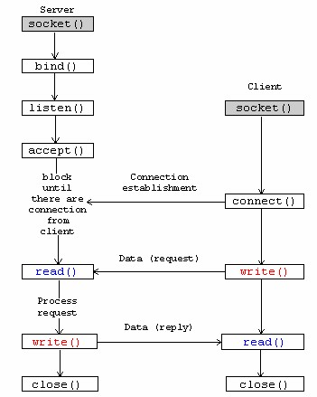
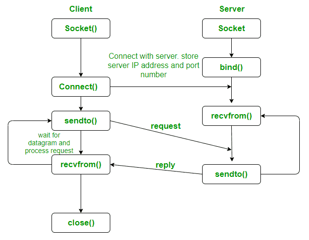
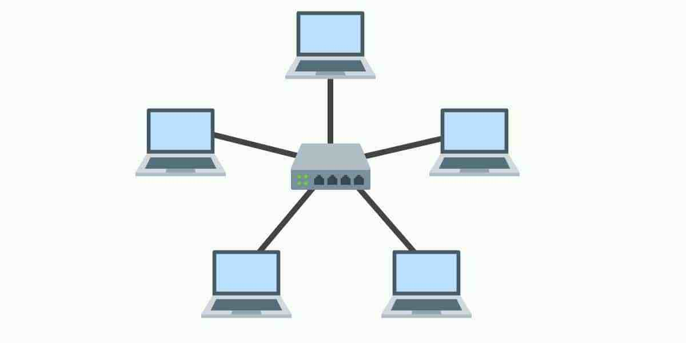

**Table of Contents**

- [COMPUTER NETWORK](#computer-network)
  - [TCP](#tcp)
    - [TCP vs. UDP](#tcp-vs-udp)
    - [Socket](#socket)
  - [Star Topology](#star-topology)
  - [Hub, Switch & Router](#hub-switch--router)
    - [Hub](#hub)
    - [Switch](#switch)
    - [Router](#router)
    - [Difference](#difference)
      - [Hub Vs. Switch](#hub-vs-switch)
      - [Switch Vs. Router](#switch-vs-router)
      - [Hub Vs. Router](#hub-vs-router)
    - [Summary](#summary)
    - [Source](#source)
  - [Network interface controller (NIC)](#network-interface-controller-nic)
    - [Purpose](#purpose)
    - [Function](#function)

# COMPUTER NETWORK

## TCP
Transmission Control Protocol  

### TCP vs. UDP
| Diff | TCP | UDP |
| :-: | :-: | :-: |
| Conection | Connection-oriented communication | Connectionless communication |
| Advantage | more reliable, ordered | lightweight|
| Example | www, email, ssh | Domain Name Service (DNS) |

### Socket

  

  

1. **int socket ( int family, int type, int protocol )**
> Create an endpoint for communication
  > * family: identifies the family by address or protocol
  > > AF_INET is for IPv4 (4 bytes for an IP address)  
  > > AF_INET6 is for IPv6 (16 bytes for an IP address)  
  > * type: identifies the semantics of communication
  > > SOCK_STREAM: Sequence of bytes, does not preserve message boundary  
  > > SOCK_DGRAM: In blocks of bytes called datagram  
  > > SOCK_RAW : Access to internal network interface (superuser)  
  > > SOCK_PACKET: To get Ethernet packets (for Linux).   
  > * protocol: identifies protocol (0 - default)  
  > > IPPROTO_TCP: with SOCK_STREAM and AF_INET (or AF_INET6)   
  > > IPPROTO_UDP: with SOCK_DGRAM and AF_INET (or AF_INET6)  
  > > ETH_P_ALL: Get Ethernet packets.  
  
  Hint: In the code, htons() is used to convert to TCP/IP network byte order (big-endian), i.e. sockfd = socket(AF_INET, SOCK_PACKET, htons(ETH_P_ALL));


2. __int bind ( int sd, struct sockaddr *name, int namelen )__  
> Assign an address to the socket.  
  > * sd: the socket descriptor returned by the socket call.  
  > * name: a pointer to an address structure.  
  > * namelen: the size of address structure.  

```
struct sockaddr {
  sa_family_t sa_family; /* address family */
  char sa_data[14]; /* up to 14 bytes of direct address */
  /* sa_familiy = AF_INET;sa_data = name of the interface (e.g., eth0, eth1)*/
};
```


3. __ioctl(int fd, int request, /*void *arg */ )__  
Has traditionally been the system interface. Used by network programming to  
  - obtain interface information  
  - set the interface configuration  
  - access the routing table  
  - access the ARP cache  

> arg: address of an ifr record  
> fd: the socket descriptor returned by the socket call.  
> request: type of the request  
> > SIOCGIFHWADDR: Get the hardware address in the ifr_hwaddr member  
> > SIOCGIFFLAGS: Get the interface flags in the ifr_flags member  
> > SIOCSIFFLAGS: Set the interface flags from the ifr_flags member  


4. __recvfrom(int sockfd, void *buf, size_t len, … )__  
Get the next available packet and store the data into buf.  


## Star Topology

  

Star Topology is Widely used in LAN nowadays. It is connected to either a hub or a switch.  


## Hub, Switch & Router
Hubs, switches and routers are the bridge to link computers, network devices and other networks. Each has two or more connectors called ports, into which you plug the cables to make the connection.  

### Hub
A hub is to sent out a message from one port to other ports. For example, if there are three computers of A, B, C, the message sent by a hub for computer A will also come to the other computers. But only computer A will respond and the response will also go out to every other port on the hub. Therefore, all the computers can receive the message and computers themselves need to decide whether to accept the message.  

### Switch
A switch is able to handle the data and knows the specific addresses to send the message. It can decide which computer is the message intended for and send the message directly to the right computer. The efficiency of switch has been greatly improved, thus providing a faster network speed.  

Initially, a switch knows nothing, and simply sends on incoming messages to all ports.   
Just by accepting that first message, however, the switch has learned something: it knows on which connection the sender of the message is located. Thus, when machine “A” responds to the message, the switch only needs to send that message out to the one connection.  
By processing the response, the switch has learned something else: it now knows on which connection machine “A” is located. That means subsequent messages destined for machine “A” need only be sent to that one port.  

### Router
Router is actually a small computer that can be programmed to handle and route the network traffic. It usually connects at least two networks together, such as two LANs, two WANs or a LAN and its ISP network. Routers can calculate the best route for sending data and communicate with each other by protocols. Only routers can be wireless.  

Consumer-grade routers perform (at minimum) two additional and important tasks: DHCP and NAT.  

DHCP — Dynamic Host Configuration Protocol — is how dynamic IP addresses are assigned. When it first connects to the network, a device asks for an IP address to be assigned to it, and a DHCP server responds with an IP address assignment. A router connected to your ISP-provided internet connection will ask your ISP’s server for an IP address; this will be your IP address on the internet. Your local computers, on the other hand, will ask the router for an IP address, and these addresses are local to your network.  
  

NAT — Network Address Translation- – is the way the router translates the IP addresses of packets that cross the internet/local network boundary. When computer “A” sends a packet, the IP address that it’s “from” is that of computer “A” — 192.168.0.1, in the figure above. When the router passes that on to the internet, it replaces the local IP address with the internet IP address assigned by the ISP — 1.2.3.4, in the example. It also keeps track, so if there’s a response the router knows to do the translation in reverse, replacing the internet IP address with the local IP address for machine “A”, and then sending that response packet on to machine “A”.  

A side effect of NAT is that machines on the internet cannot initiate communications to local machines; they can only respond to communications initiated by them. This means that the router also acts as an effective firewall.  

### Difference
#### Hub Vs. Switch
A hub works on the physical layer (Layer 1) of OSI model while Switch works on the data link layer (Layer 2). Switch is more efficient than the hub. A switch can join multiple computers within one LAN, and a hub just connects multiple Ethernet devices together as a single segment. Switch is smarter than hub to determine the target of the forwarding data. Since switch has a higher performance, its cost will also become more expensive.  

#### Switch Vs. Router
In the OSI model, router is working on a higher level of network layer (Layer 3) than switch. Router is very different from the switch because it is for routing packet to other networks. It is also more intelligent and sophisticated to serve as an intermediate destination to connect multiple area networks together. A switch is only used for wired network, yet a router can also link with the wireless network. With much more functions, a router definitely costs higher than a switch.  

#### Hub Vs. Router
As mentioned above, a hub only contains the basic function of a switch. Hence, differences between hub and router are even bigger. For instance, hub is a passive device without software while router is a networking device, and data transmission form in hub is in electrical signal or bits while in router it is in form of packet.  

### Summary
Hubs are “dumb” devices that pass on anything received on one connection to all other connections.  
Switches are semi-intelligent devices that learn which devices are on which connection.  
Routers are essentially small computers that perform a variety of intelligent tasks.  

### Source
[Difference Between a Hub, a Switch, and a Router](https://askleo.com/whats_the_difference_between_a_hub_a_switch_and_a_router/)  

## Network interface controller (NIC)
A network interface card (NIC) is a hardware component without which a computer cannot be connected over a network. It is a circuit board installed in a computer that provides a dedicated network connection to the computer. It is also called network interface controller, network adapter or LAN adapter.  

### Purpose
NIC allows both wired and wireless communications.  

NIC allows communications between computers connected via local area network (LAN) as well as communications over large-scale network through Internet Protocol (IP).  

NIC is both a physical layer and a data link layer device, i.e. it provides the necessary hardware circuitry so that the physical layer processes and some data link layer processes can run on it.  

### Function
Assigned with a unique Media Access Control (MAC) address hardcoded in ROM. (Most routers or operating system nowadays allow to change the MAC address on the software level).  

Contain hardware that allows to recognize its MAC address, Broadcast address and Multicast addresses (direct frames to groups of stations).  

Can be set to run in promiscuous mode where it listens to all transmissions. In the promiscuous mode, the NIC will accept the received frame that is not destined to it. (Can be used by hackers to intercept unencrypted passwords and other information; Cane be used by system administrators to troubleshoot the network.)  


