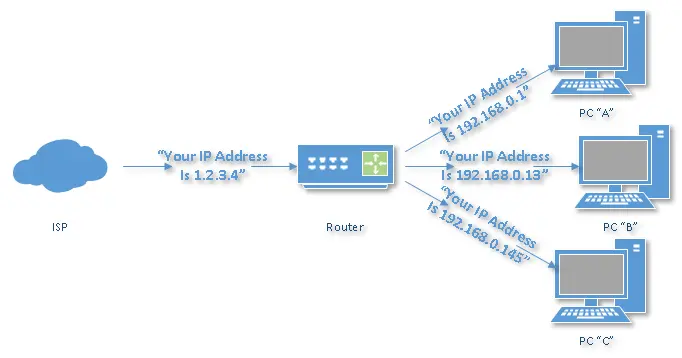

# COMPUTER NETWORK

## Hub, Switch & Router
Hubs, switches and routers are the bridge to link computers, network devices and other networks. Each has two or more connectors called ports, into which you plug the cables to make the connection.  

### Hub
A hub is to sent out a message from one port to other ports. For example, if there are three computers of A, B, C, the message sent by a hub for computer A will also come to the other computers. But only computer A will respond and the response will also go out to every other port on the hub. Therefore, all the computers can receive the message and computers themselves need to decide whether to accept the message.  

### Switch
A switch is able to handle the data and knows the specific addresses to send the message. It can decide which computer is the message intended for and send the message directly to the right computer. The efficiency of switch has been greatly improved, thus providing a faster network speed.  

Initially, a switch knows nothing, and simply sends on incoming messages to all ports.   
Just by accepting that first message, however, the switch has learned something: it knows on which connection the sender of the message is located. Thus, when machine “A” responds to the message, the switch only needs to send that message out to the one connection.  
By processing the response, the switch has learned something else: it now knows on which connection machine “A” is located. That means subsequent messages destined for machine “A” need only be sent to that one port.  

### Router
Router is actually a small computer that can be programmed to handle and route the network traffic. It usually connects at least two networks together, such as two LANs, two WANs or a LAN and its ISP network. Routers can calculate the best route for sending data and communicate with each other by protocols. Only routers can be wireless.  

Consumer-grade routers perform (at minimum) two additional and important tasks: DHCP and NAT.  

DHCP — Dynamic Host Configuration Protocol — is how dynamic IP addresses are assigned. When it first connects to the network, a device asks for an IP address to be assigned to it, and a DHCP server responds with an IP address assignment. A router connected to your ISP-provided internet connection will ask your ISP’s server for an IP address; this will be your IP address on the internet. Your local computers, on the other hand, will ask the router for an IP address, and these addresses are local to your network.  
  

NAT — Network Address Translation- – is the way the router translates the IP addresses of packets that cross the internet/local network boundary. When computer “A” sends a packet, the IP address that it’s “from” is that of computer “A” — 192.168.0.1, in the figure above. When the router passes that on to the internet, it replaces the local IP address with the internet IP address assigned by the ISP — 1.2.3.4, in the example. It also keeps track, so if there’s a response the router knows to do the translation in reverse, replacing the internet IP address with the local IP address for machine “A”, and then sending that response packet on to machine “A”.  

A side effect of NAT is that machines on the internet cannot initiate communications to local machines; they can only respond to communications initiated by them. This means that the router also acts as an effective firewall.  

### Difference
#### Hub Vs. Switch
A hub works on the physical layer (Layer 1) of OSI model while Switch works on the data link layer (Layer 2). Switch is more efficient than the hub. A switch can join multiple computers within one LAN, and a hub just connects multiple Ethernet devices together as a single segment. Switch is smarter than hub to determine the target of the forwarding data. Since switch has a higher performance, its cost will also become more expensive.  

#### Switch Vs. Router
In the OSI model, router is working on a higher level of network layer (Layer 3) than switch. Router is very different from the switch because it is for routing packet to other networks. It is also more intelligent and sophisticated to serve as an intermediate destination to connect multiple area networks together. A switch is only used for wired network, yet a router can also link with the wireless network. With much more functions, a router definitely costs higher than a switch.  

#### Hub Vs. Router
As mentioned above, a hub only contains the basic function of a switch. Hence, differences between hub and router are even bigger. For instance, hub is a passive device without software while router is a networking device, and data transmission form in hub is in electrical signal or bits while in router it is in form of packet.  

## Summary
Hubs are “dumb” devices that pass on anything received on one connection to all other connections.  
Switches are semi-intelligent devices that learn which devices are on which connection.  
Routers are essentially small computers that perform a variety of intelligent tasks.  

## Source: [Difference Between a Hub, a Switch, and a Router](https://askleo.com/whats_the_difference_between_a_hub_a_switch_and_a_router/)
