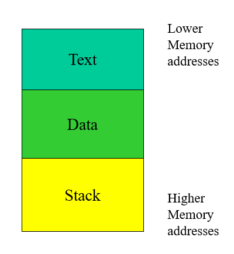

# Buffer Overflow

When a program is executed, the system maintains an execution stack to store the information about the active functions in the program. Hackers smash the stack to modify the address (stored in the execution stack) of the next instruction to be executed when the function terminates.  

## Process Memory Organization

- Text region
    - Fixed by the program
    - Includes code (instructions)
    - Read only
- Data region
    - Contains initialized and uninitialized data
    - Static variables are stored here.
- Stack region
    - Last in, first out (LIFO)

